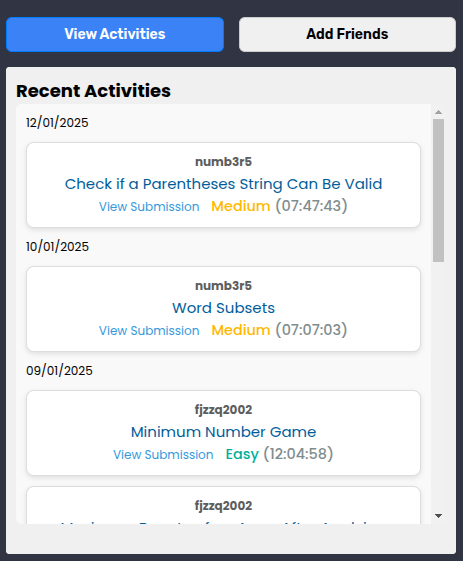
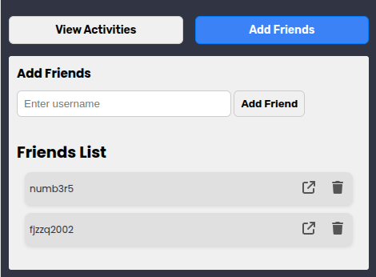
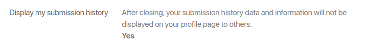
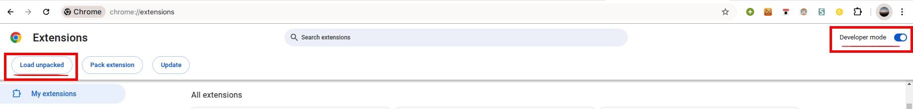

# LeetCode Friends

**LeetCode Friends** is a Chrome extension that lets you add your LeetCode friends and view their **recent accepted submissions** in one place.

It uses the **LeetCode GraphQL API** to fetch and display friends’ activity in a clean, minimal interface.

<details>
<summary><strong>✨ GUI Preview</strong></summary>

<br />

<div style="display: flex; align-items: center; justify-content: space-between; gap: 30px;">
    
    
</div>

</details>

---

## Features

- Add and Remove friends.
- Display recent activity for each of your LeetCode friends.

  
> [!IMPORTANT]  
> This feature won't work if the user has made their submission history private on leetcode.
>  

---

## Installation & Setup

**1. Clone the repository**

```bash
git clone https://github.com/pandfun/LeetCode-Friends.git
```

**2. Building the React files**

```bash
cd ui
npm run build
```

**3. Load the extension in Chrome**

1. Open Chrome and go to `chrome://extensions`
2. Enable **Developer mode** (top-right)
3. Click **Load unpacked**
4. Select the `LeetCode-Friends` folder

<br />



---

⭐ If you like this project, consider starring the repo!

