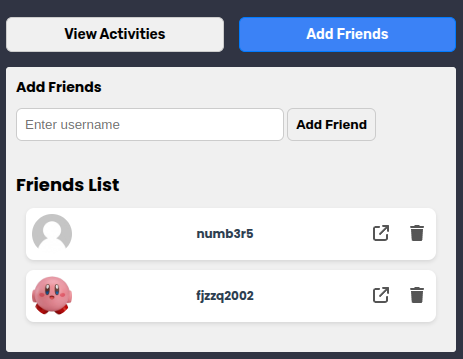

# LeetCode Friends

This chrome extension allows users to add and displays recent activity of your LeetCode friends.
It works based on the LeetCode GraphQL API to retrieve recent activities of friends.

<details>
  <summary>✨ GUI Preview ✨</summary>

  <div style="display: flex; align-items: center; justify-content: space-between; gap: 30px;">
      
      
  </div>

</details>


<br>

- [Features](#features)
- [Installation & Setup](#installation-and-setup)
   - [Prerequisites](#prerequisites)
   - [Installation](#installation-steps)
- [Customizations](#customizations)
- [Preview](#preview)
- [Acknowledgements](#acknowledgements)


---
<br>

## Features

- Add and Remove friends.
- Display recent activity for each of your LeetCode friends.

> [!IMPORTANT]  
> This feature won't work if the user has made their submission history private on leetcode.
>  

---
<br>

## Installation and Setup

### Prerequisites

- **Node.js**: Ensure that Node.js is installed on your machine. If not, you can download it from [Node.js official website](https://nodejs.org/).

### Installation Steps

1. Clone the Repository:
```bash
git clone https://github.com/pandfun/LeetCode-Friends.git
```

2. Set Up the Extension on Chrome:
   <br>
   
    - Open Chrome and go to `chrome://extensions`.
    - Enable "Developer mode" (top right corner).
    - Click "Load unpacked" (top left corner).
    - Select the `LeetCode-Friends` folder.


---
<br>

## Customizations

- Change how many recent submissions are fetched for each user:

  1: Navigate to : [`src/graphql/problems.js`](https://github.com/pandfun/LeetCode-Friends/blob/c445ee48bbe57e80c4f06e3eddd024d87d7d7aac/src/graphql/problems.js#L3)
  
  2: Go the line having this (or click on the hyperline above to find the line):
    
  ```javascript
  const url = "https://leetcode.com/graphql";
  
  const NUM_SUBMISSIONS = 5; // Change this
  
  // Get the recent AC Submissions for a user
  export const getRecentAcSubmissions = async (username, limit = NUM_SUBMISSIONS) => {...}
  ```

  3: Modify the value of `NUM_SUBMISSIONS` (Leetcode allows a max value of `20`).


---
<br>


## Preview

<div style="display: flex; align-items: center; justify-content: space-between; gap: 30px;">
   
   
</div>


---
<br>


## Acknowledgements

- [LeetCode](https://leetcode.com/) for providing the problem-solving platform.
- [GraphQL](https://graphql.org/) for providing a flexible query language for APIs.
- [Node.js](https://nodejs.org/) for server-side JavaScript execution.
